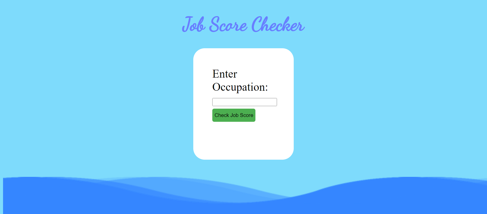

<h2>Problem Statement:</h2>
Making career choices and AI based counselling accessible to every child at secondary level along with aptitude tests and detailed career paths
<h2>Abstract:</h2>
1. Assisting individuals in making informed career choices.
<br>
2. OpenAI API integration for personality trait analysis.
<br>
3. Features: Personalized Career Counseling, Profession Road Maps, NEP Counseling!
<br>
4. Predict Job Safety Score
<br>
5. Marks-Based Subject Suggestions!

<h2>Getting Started:</h2>

1. Clone the repository to your local machine:
  ```bash
  git clone https://github.com/ShauryaMalhan/Path-Pilot/tree/main
  ```
2. Install the required dependencies:
  ```
  npm install
  ```
3. Start the application:
  ```
  node index.js
  ```
The application will be accessible in your web browser at http://localhost:3000. You can now begin using the app to access roadmaps and get NEP personal counseling.


<h2>Features:</h2>

### 1. Career Counselling Quiz
Our project provides a career counseling quiz designed to assist you in determining your career path based on your personalities and interests.


### 2. Career Roadmaps
The roadmap functionality enables you to retrieve a personalized career roadmap tailored to your individual professional journey.


### 3. Job Score
The job score feature assists in determining the risk associated with the job you are considering pursuing in the near future.



### 4. Marks Upload
The Marks Upload feature facilitates the model in training based on your academic performance, ultimately offering personalized career recommendations aligned with both your personality and marks.


<h2>Contributing:</h2>
We welcome contributions from the community to improve and enhance the WebApp. If you would like to contribute, please follow these steps:

Fork the repository.
1. Create a new branch for your feature or bug fix.
2. Make your changes and commit them.
3. Push your changes to your fork.
4. Create a pull request to the main repository.
   
Our team will review your pull request, and if accepted, your changes will be incorporated into the WebApp.
